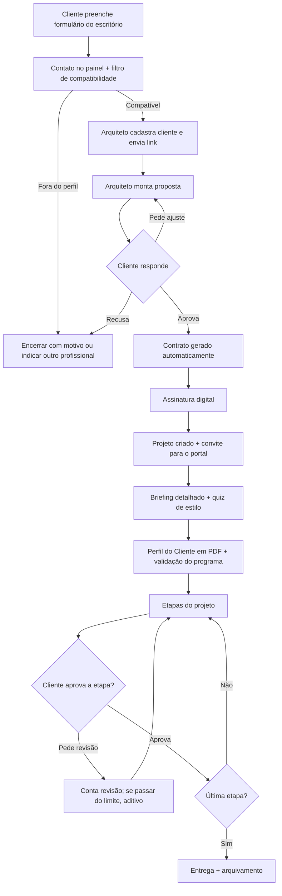

# NorteArq: especificação do produto (v1)

> **O norte do seu projeto.**
> Seu cliente explica o que quer sozinho. Você só projeta.

Documento-base para desenhar o produto (telas, fluxos e regras). Consolida a ideação, o áudio com a
arquiteta, o fluxograma do escritório e a pesquisa de mercado.

**Legenda:** ✅ decidido · 🟡 proposta inicial, validar com arquitetos · ❓ decisão em aberto

---

## Sumário
1. Visão geral
2. Escopo da primeira versão
3. Quem usa (papéis)
4. Estrutura de acesso
5. Jornada completa
6. Módulos e regras de funcionamento
7. Regras gerais da plataforma
8. Planos comerciais
9. Avisos automáticos
10. Mapa de telas
11. Modelo de dados (resumo)
12. Stack técnica
13. Roteiro e métricas
14. Decisões em aberto
15. Referências

---

## 1. Visão geral

### O que é
SaaS (sistema por assinatura) para **arquitetos e designers de interiores**. Ele automatiza a parte burocrática e
de relacionamento com o cliente, do primeiro contato até a entrega, para o arquiteto gastar o tempo
projetando.

### Público inicial ✅
- Arquiteto autônomo e escritório pequeno (1 a 5 pessoas).
- Projetos residenciais: arquitetura, interiores, reforma e legalização.
- Hoje usa WhatsApp, PDF e Google Drive soltos.

### Dores que resolve ✅
| # | Dor | Módulo |
|---|---|---|
| 1 | O cliente não sabe explicar o que quer; o briefing leva horas | 02 |
| 2 | Tempo perdido com quem não vai fechar; proposta e contrato feitos à mão | 01 |
| 3 | Arquivos fora da nuvem; cliente "não lembra" do que aprovou | 03 |
| 4 | Revisões e visitas sem limite: o arquiteto trabalha de graça | 03 / 04 |

### Diferenciais frente ao mercado ✅
Concorrentes (Arquio, ARQCLAVE, Projete.app, Studio Obra Pro, REFRESHER, Archsplace) focam em "gestão de
escritório". O NorteArq foca em **tirar o cliente das costas do arquiteto**:
1. **Briefing configurável**: arquitetura e interiores separados, perguntas por ambiente, **quiz visual de
   estilo** e imagens e perguntas do próprio arquiteto.
2. **Do briefing ao contrato sem redigitar**: proposta e contrato preenchidos automaticamente.
3. **Controle do contratado**: revisões, visitas e aditivos contados e visíveis ao cliente.
4. **WhatsApp primeiro**: o cliente recebe tudo por link, sem instalar nada.
5. **Marca do arquiteto**: o cliente final vê o escritório, não o NorteArq.

### Nome e domínio
- Nome: **NorteArq** ✅ · Reserva: **RumoArq**
- Domínios: `nortearq.com.br` e `nortearq.com` estavam sem registro em 30/09/2026
- ❓ Busca no INPI (classes 42 e 9) pendente: existem escritórios chamados "Norte Arquitetura"

---

## 2. Escopo da primeira versão ✅

| Módulo | Nome | V1 | Depois |
|---|---|:---:|:---:|
| 00 | Base | ✅ | |
| 01 | Captação e fechamento | ✅ | |
| 02 | Briefing detalhado | ✅ | |
| 03 | Projeto e aprovações | ✅ | |
| 04 | Acompanhamento de obra | | Fase 2 |
| 05 | Pós-entrega | | Fase 2 |
| 06 | Adicionais | | Fase 3 |

**Fora da V1 (de propósito):** financeiro completo, cronograma de obra, gestão de equipe e tarefas, cobrança
automática de visitas, IA.

**Extensão de 07/10/2026 — Financeiro do escritório:** visão consolidada das parcelas dos contratos assinados,
registro de despesas com histórico e consulta da conta Asaas. Incluído no módulo 01, para Dono e Administrador.
Não inclui contabilidade, conciliação bancária nem execução de pagamentos de despesas.

---

## 3. Quem usa (papéis) ✅

| Papel | O que faz | Como acessa |
|---|---|---|
| **Arquiteto (dono)** | Configura o escritório, atende clientes, gerencia tudo e paga a assinatura | `/app` com login |
| **Equipe** (plano Escritório) | Administrador ou Colaborador (matriz abaixo) | `/app` com login |
| **Cliente final** | Pede orçamento, responde briefing, aprova proposta, etapas e aditivos | Links sem login; depois `/portal` com login |
| **Admin NorteArq** | Suporte, planos, banco de imagens padrão | Painel interno (fora da V1) |

### Matriz de permissões da equipe ✅
Fonte única no código: `lib/permissoes.ts` (menu, páginas e botões). A trava de verdade está no banco
(RLS e funções, migrações 0015, 0024, 0026, 0032 e 0033), testada com os três perfis.

| Ação | Dono | Administrador | Colaborador |
|---|:-:|:-:|:-:|
| Clientes: cadastrar, editar, arquivar, enviar links | ✅ | ✅ | ✅ |
| Briefings: enviar e ver respostas | ✅ | ✅ | ✅ |
| Projetos: etapas, arquivos, capa, envio para aprovação, aprovações externas | ✅ | ✅ | ✅ |
| Projetos: definir prazos planejados das etapas | ✅ | ✅ | ✅ |
| Projetos: pausar, retomar, entregar, encerrar e reabrir | ✅ | ✅ | ❌ |
| Fornecedores e outras entradas do financeiro | ✅ | ✅ | ❌ |
| Pedidos de orçamento (mostram o investimento do cliente) | ✅ | ✅ | ❌ |
| Propostas, contratos, pagamentos, aditivos e recibos (valores) | ✅ | ✅ | ❌ |
| Revisão além do limite: conceder cortesia ou cobrar como aditivo | ✅ | ✅ | ❌ |
| Excluir cliente e juntar cadastros repetidos | ✅ | ✅ | ❌ |
| Configurar o escritório (marca, serviços, faixa de preço, modelos, editor de briefing) | ✅ | ✅ | ❌ (só vê) |
| Estornar pagamento | ✅ | ❌ | ❌ |
| Anonimizar cliente (LGPD) | ✅ | ❌ | ❌ |
| Equipe: convidar, mudar perfil, remover | ✅ | ❌ | ❌ |
| Plano e assinatura | ✅ | ❌ | ❌ |

Notificações seguem a mesma regra: o Colaborador só recebe as de briefing e de etapa. Ações sem volta
(excluir, anonimizar, juntar, estornar, cancelar contrato, remover membro) pedem a senha de quem está logado.

**Duplicidade (migração 0032):** CPF/CNPJ não repete no mesmo escritório; e-mail ou WhatsApp repetido mostra
aviso ("abrir o existente" ou "cadastrar mesmo assim"); cadastros repetidos podem ser juntados; o mesmo
pedido de orçamento reenviado em até 7 dias atualiza o anterior; converter pedido liga ao cliente que já
existe; nomes de etapas, modelos e serviços não repetem. Uma conta pertence a um escritório só: convidar
quem já tem escritório é recusado na hora.

---

## 4. Estrutura de acesso ✅

| Área | Endereço | Login | Marca exibida |
|---|---|---|---|
| Site de vendas | `nortearq.com.br` | Não | NorteArq |
| Sistema do arquiteto | `nortearq.com.br/app` (depois `app.nortearq.com.br`) | Sim | NorteArq |
| Formulário do escritório | `nortearq.com.br/e/[escritorio]` | Não | Escritório |
| Links do cliente | `nortearq.com.br/c/[token]/...` | Não (token) | Escritório |
| Portal do cliente | `nortearq.com.br/portal` (plano Escritório: domínio próprio) | Sim | Escritório |

**Jornada do arquiteto:** landing → teste grátis de 14 dias → configuração inicial em 4 passos → link do
escritório → uso com clientes reais → escolhe o plano e paga.

---

## 5. Jornada completa ✅

---

## 6. Módulos e regras de funcionamento

### 00 · Base

**Objetivo:** estrutura comum a todos os módulos.

**Telas:** cadastro, login, recuperar senha, configuração inicial, painel inicial, clientes (lista e
ficha), configurações (marca, serviços, faixa de preço, contrato, avisos, plano, equipe).

**Regras**
- **RN-00.1** ✅ Tudo pertence a um escritório. Um usuário nunca vê dados de outro escritório.
- **RN-00.2** ✅ O cliente final só vê os próprios projetos, sempre com a marca do escritório.
- **RN-00.3** 🟡 A configuração inicial é obrigatória no primeiro acesso: nome do escritório, serviços e
  faixa de preço. Logo e cores podem ficar para depois.
- **RN-00.4** ✅ Serviços padrão: Arquitetura, Interiores, Reforma e Legalização. O arquiteto pode criar,
  renomear ou desativar. Cada serviço define se tem briefing (Legalização: não).
- **RN-00.5** 🟡 A etapa do cliente avança sozinha conforme os eventos (contato → proposta → contrato →
  projeto → entregue). O arquiteto pode encerrar manualmente.
- **RN-00.6** 🟡 O painel inicial mostra só pendências acionáveis, ordenadas pela mais antiga.

### 01 · Captação e fechamento

**Objetivo:** filtrar contatos e fechar contrato sem redigitar nada.

**Telas do arquiteto:** contatos, propostas (lista e edição), contratos, pagamentos.
**Telas do cliente:** formulário do escritório, proposta (link), contrato (link).

**Estados**
- Contato: `novo → compatível | fora do perfil | a avaliar → convertido | encerrado`
- Proposta: `rascunho → enviada → aprovada | ajuste pedido | recusada | expirada`
- Contrato: `aguardando dados → aguardando assinatura → assinado | cancelado`

**Regras: contato e filtro**
- **RN-01.1** ✅ O formulário público pede: nome, WhatsApp, e-mail, serviços, área (m²), localização,
  orçamento disponível e prazo desejado, além do aceite de privacidade (LGPD).
- **RN-01.2** 🟡 Filtro de compatibilidade:
  - orçamento informado ≥ faixa mínima do escritório → **compatível**
  - orçamento abaixo da faixa → **fora do perfil**
  - orçamento não informado → **a avaliar**
  - prazo desejado antes da próxima data livre do escritório → alerta "prazo apertado" (não muda o status)
- **RN-01.3** ✅ O filtro **não bloqueia** nada. Só sinaliza, e o arquiteto decide.
- **RN-01.4** 🟡 Encerrar um contato exige motivo: orçamento, prazo, escopo, sem retorno ou outro.
- **RN-01.5** ✅ Converter contato em cliente reaproveita todos os dados, sem redigitar.

**Regras: proposta**
- **RN-01.6** ✅ A proposta tem: escopo por serviço, entregáveis, honorários, forma de pagamento (entrada,
  parcelas por etapa, saldo), prazos, **revisões incluídas**, **visitas incluídas** e o que não está incluído.
- **RN-01.7** 🟡 A proposta enviada não pode ser editada. Para um ajuste, cria-se uma nova versão (v1, v2…)
  e o link antigo passa a mostrar a versão mais recente.
- **RN-01.8** 🟡 Validade padrão de 15 dias (configurável). Depois disso, o link mostra "proposta expirada:
  fale com o escritório".
- **RN-01.9** ✅ O cliente pode **aprovar**, **pedir ajuste** (comentário obrigatório) ou **recusar**
  (motivo obrigatório).
- **RN-01.10** ✅ Toda resposta registra data, hora e IP, para servir de prova.
- **RN-01.11** 🟡 Relatório de motivos de recusa no painel: onde o escritório perde clientes.

**Regras: contrato e pagamento**
- **RN-01.12** ✅ O contrato só é gerado a partir de uma proposta aprovada, usando o modelo do escritório com
  campos automáticos (`{{cliente.nome}}`, `{{proposta.valor_total}}`…).
- **RN-01.13** 🟡 Se faltarem dados obrigatórios (CPF/CNPJ, endereço), o link do contrato pede ao cliente
  que complete antes de assinar.
- **RN-01.14** ✅ Assinatura digital por serviço externo (ZapSign ou Clicksign).
- **RN-01.15** ✅ Contrato assinado: o projeto é criado automaticamente, com as etapas padrão dos serviços e
  com as revisões e visitas da proposta, e o cliente recebe o convite para criar a senha do portal.
- **RN-01.16** 🟡 Na V1, o pagamento é **só controle**: o arquiteto marca "pago" ou "pendente". O NorteArq
  não cobra o cliente final.
- **RN-01.17** ❓ A próxima etapa deve ser liberada só depois do pagamento? Sugestão para a V1: mostrar
  aviso, sem bloquear.

### 02 · Briefing detalhado

**Objetivo:** o cliente explica o que quer sozinho, com imagens.

**Telas do arquiteto:** briefings (lista e Perfil do Cliente), editor de briefing, banco de imagens de
estilo.
**Telas do cliente:** briefing guiado (link).

**Estados:** `pendente → em andamento → respondido → validado`

**Conteúdo padrão** ✅
- **Arquitetura:** moradores, quartos, trabalho em casa (escritório), recebe visitas (quarto de hóspedes),
  lazer, piscina, metragem do terreno, fachada de referência.
- **Interiores:** o cliente escolhe os ambientes (sala, quarto, cozinha, banheiro, varanda…) e cada um abre
  as próprias perguntas. Exemplo do quarto: estilo, espelho, penteadeira, cama, iluminação direta,
  indireta ou as duas.
- **Reforma:** o que muda, estado atual (fotos), medidas, prioridades.
- **Comum a todos:** quiz visual de estilo, fotos de referência, levantamento do imóvel (fotos, medidas,
  documentos), rotina e prioridades, limite de investimento.

**Regras**
- **RN-02.1** ✅ O cliente só vê os blocos dos serviços contratados que têm briefing.
- **RN-02.2** 🟡 Por padrão, o briefing detalhado é enviado **depois do contrato** (o preliminar já filtrou
  antes). Nas configurações, o arquiteto pode escolher enviar antes da proposta.
- **RN-02.3** ✅ Salvamento automático: o cliente pode parar e continuar depois pelo mesmo link.
- **RN-02.4** 🟡 O link vale 30 dias. Reenviar gera um link novo e invalida o anterior.
- **RN-02.5** 🟡 Quiz de estilo: no mínimo 12 imagens, e o cliente marca "gosto" ou "não gosto".
  - estilo principal = o que tiver maior percentual de "gosto"
  - estilos secundários = os dois seguintes
  - em caso de empate, mostra os dois como principais
- **RN-02.6** 🟡 Fotos de referência: até 20 imagens de 10 MB cada.
- **RN-02.7** ✅ Depois de enviado, o cliente não edita mais. O arquiteto pode reabrir.
- **RN-02.8** ✅ O briefing gera o **Perfil do Cliente em PDF**, com a marca do escritório: estilo,
  ambientes, necessidades e referências.
- **RN-02.9** 🟡 O arquiteto marca o briefing como **validado** depois da reunião. Ele vira o programa de
  necessidades oficial do projeto.
- **RN-02.10** ✅ Editor de briefing: o arquiteto liga e desliga perguntas, muda a ordem, cria perguntas
  (texto, escolha única, múltipla escolha, número, sim/não, foto) e sobe as próprias imagens de estilo.
- **RN-02.11** 🟡 Perguntas padrão podem ser desativadas, mas não apagadas.
- **RN-02.12** ✅ Alterar o modelo não muda briefings já enviados: cada briefing guarda uma cópia das
  perguntas.

### 03 · Projeto e aprovações

**Objetivo:** centralizar os arquivos e registrar cada aprovação, sem revisão infinita.

**Telas do arquiteto:** projetos (lista), projeto (etapas, arquivos, aprovações, revisões, aditivos,
aprovações externas, pagamentos).
**Telas do cliente:** portal (meus projetos) e projeto (etapas, arquivos, aprovar, aditivos, pagamentos).

**Estados**
- Etapa: `pendente → em andamento → aguardando aprovação → revisão → aprovada`
- Aditivo: `enviado → aprovado | recusado`

**Etapas padrão** ✅ (editáveis): Estudo preliminar → Anteprojeto → Aprovações externas (condomínio,
prefeitura) → Projeto executivo → Entrega.

**Regras: etapas e aprovação**
- **RN-03.1** ✅ As etapas seguem uma ordem. O arquiteto pode adicionar, renomear e reordenar antes de
  iniciar.
- **RN-03.2** 🟡 Para enviar uma etapa para aprovação, ela precisa ter pelo menos 1 arquivo visível ao
  cliente.
- **RN-03.3** ✅ O cliente **aprova** ou **pede revisão** (comentário obrigatório).
- **RN-03.4** ✅ A aprovação é registrada com data, hora, IP e usuário, e **não pode ser desfeita**.
- **RN-03.5** ✅ Etapa aprovada não volta. Mudança depois da aprovação vira **aditivo**.
- **RN-03.6** ✅ Lembretes ao cliente com etapa aguardando aprovação: e-mail depois de 3 e de 7 dias (sem
  repetir; reenviar a etapa recomeça a contagem). No de 7 dias, o arquiteto também é avisado no sininho.
- **RN-03.7** ❓ Aprovação tácita (aprovar sozinho depois de X dias sem resposta)? Pode dar problema
  jurídico. Sugestão: só se estiver no contrato, e fora da V1.

**Regras: controle de revisões**
- **RN-03.8** ✅ Cada pedido de revisão consome 1 revisão do total contratado.
- **RN-03.9** ✅ O contador fica visível para os dois lados: "2 de 3 revisões usadas".
- **RN-03.10** ✅ Ao usar a última revisão incluída e ao passar do limite, o sistema avisa os dois lados ("esta revisão pode ser cobrada") e o
  arquiteto escolhe: **conceder como cortesia** ou **gerar aditivo**.

**Regras: arquivos**
- **RN-03.11** ✅ Uma versão nova nunca apaga a anterior (Rev01, Rev02…).
- **RN-03.12** ✅ O arquiteto escolhe se cada arquivo é **visível ao cliente** ou interno. O cliente só vê
  o que já foi **enviado**: arquivo visível de etapa enviada, criado até o último envio. Arquivo novo de
  uma etapa em andamento ou em revisão aparece para ele quando a etapa for enviada de novo.
- **RN-03.13** ✅ Formatos: PDF, JPG, PNG e WEBP abrem num visualizador na própria página (zoom, pinça,
  páginas do PDF, troca de revisão, Baixar e Abrir em nova aba). DWG, SKP e outros mostram um ícone e
  ficam só para baixar. O download sai com o nome original ("Planta baixa - Rev02.pdf").
- **RN-03.14** ✅ Limite de 50 MB por arquivo (o máximo do plano grátis do Supabase; 200 MB quando o
  armazenamento for pago). O total, com miniaturas e prévias, conta no espaço do plano
  (2 / 30 / 150 GB) e o banco recusa o envio quando passa. Aviso a partir de 80%.
- **RN-03.18** ✅ Cada arquivo tem um tipo: Prancha técnica, Render 3D, Documento ou Outro, sugerido pela
  extensão e trocado com um clique. (Foto da obra entra com o módulo 04.)
- **RN-03.19** ✅ Miniaturas geradas no navegador ao enviar (imagem até 640 px; PDF pela primeira página)
  e uma prévia de 2.400 px para imagens grandes, que é o que o visualizador abre. Os arquivos antigos
  ganham miniatura uma vez, em segundo plano, quando o arquiteto abre o projeto.
- **RN-03.20** ✅ **Renders do projeto:** mural com a versão atual de cada render, de todas as etapas.
  **Capa do projeto:** um render visível escolhido pelo arquiteto; se for apagado, escondido ou deixar de
  ser render, vale o render visível mais recente; sem render, capa neutra com as iniciais.
- **RN-03.21** 🟡 Fase 2: o cliente marca um ponto na imagem e comenta (conta como revisão) e
  comparação lado a lado entre revisões.

**Regras: aditivos e aprovações externas**
- **RN-03.15** ✅ O aditivo tem descrição, valor e impacto no prazo. O cliente aprova ou recusa.
- **RN-03.16** 🟡 Aditivo aprovado soma ao contrato e pode adicionar revisões ou visitas.
- **RN-03.17** ✅ As aprovações externas (condomínio, prefeitura) são registradas com status e protocolo.
  Não dependem do cliente.

### 04 · Acompanhamento de obra (Fase 2)
- Visita: data, horário, motivo (revestimento, materiais…), fotos e observações. O cliente é avisado.
- Contador "4 de 6 visitas". Ao acabar, os dois lados são avisados. Visita extra é marcada como extra.
- O cliente pode pedir visita pelo portal.
- Alterações na obra têm impacto em custo e prazo, e são aprovadas **antes** de executar.
- Vistoria final com lista de pendências, depois entrega e recebimento formalizado.
- O módulo só aparece em projetos com "tem obra" marcado.

### 05 · Pós-entrega (Fase 2)
- Avaliação de 0 a 10 com comentário. Com autorização, vira depoimento.
- Projeto arquivado com todos os documentos e aprovações.
- Lembrete de retorno depois de 6 meses.

### 06 · Adicionais (Fase 3)
Página pública do arquiteto (portfólio e pedido de orçamento) · assistente de IA (resumo do briefing,
moodboard) · loja de modelos (briefings, contratos, templates CAD) · rede de indicação · espaço extra ·
cobrança Pix de visita extra.

---

## 7. Regras gerais da plataforma

### Teste grátis e assinatura 🟡
- **RG-1** 14 dias grátis com todos os recursos do plano Profissional, sem cartão.
- **RG-2** No fim do teste, sem pagamento: **modo leitura por 30 dias** (vê tudo, não cria nada). Depois
  disso, a conta é suspensa e os dados ficam guardados por mais 90 dias.
- **RG-3** Inadimplência: 7 dias de tolerância e depois modo leitura.
- **RG-4** Nos modos leitura e suspensão, o cliente final **continua conseguindo ver e baixar** os arquivos
  já entregues.
- **RG-5** Ao mudar para um plano menor, se o escritório passar dos limites, ele não perde nada, mas não
  cria itens novos até ficar dentro do limite.
- **RG-6** Cancelamento sem multa a qualquer momento. O acesso vale até o fim do período pago.

### Segurança e LGPD ✅
- **RG-7** Links sem login usam um código aleatório e longo, que expira e só dá acesso àquele item. Não
  dão acesso ao portal.
- **RG-8** Todo formulário público tem aceite da política de privacidade.
- **RG-9** O arquiteto pode exportar e excluir os dados de um cliente quando ele pedir.
- **RG-10** Termos de uso (/termos) e política de privacidade (/privacidade) publicados; faltam razão
  social, CNPJ e e-mail de contato (lib/legal.ts) e a revisão por advogado antes do lançamento.
- **RG-11** Ações importantes (aceites, aprovações, assinaturas) ficam registradas com data, hora, IP e
  usuário.

---

## 8. Planos comerciais 🟡

| | **Briefing** | **Profissional** ⭐ | **Escritório** |
|---|---|---|---|
| Preço mensal | R$ 49 | R$ 97 | R$ 197 |
| Preço anual (2 meses grátis) | R$ 490 | R$ 970 | R$ 1.970 |
| Módulos | 00 + 02 | 00 + 01 + 02 + 03 | Todos |
| Usuários | 1 | 1 | Até 5 |
| Briefings por mês | 15 | Ilimitados | Ilimitados |
| Projetos ativos | n/a | 15 | Ilimitados |
| Espaço para arquivos | 2 GB | 30 GB | 150 GB |
| Marca do escritório | Logo | Logo + cores | Completa + domínio próprio |
| Módulos 04/05 (quando lançarem) | n/a | Incluídos | Incluídos |

**Adicionais**
| Item | Preço sugerido |
|---|---|
| Implantação (configuro briefing, imagens e contrato) | R$ 297, uma vez |
| +50 GB de espaço | R$ 19/mês |
| Usuário extra (Escritório) | R$ 29/mês |
| Pacote de assinaturas digitais (se passar da franquia) | conforme o serviço contratado |

**Referência de mercado:** Projete.app a partir de R$ 29 · Arquio de R$ 99,90 a R$ 179,90 · ARQCLAVE de
R$ 97 a R$ 397 · REFRESHER gratuito.

**Projeção (média de R$ 97):** 50 arquitetos ≈ R$ 4,8 mil/mês · 200 ≈ R$ 19,4 mil/mês · 500 ≈ R$ 48,5 mil/mês.
São cerca de 200 mil arquitetos registrados no CAU; 500 é menos de 0,3%.

**Como vender:** arquiteta parceira como primeiro caso de sucesso · modelo de briefing grátis como isca ·
Instagram e Reels mostrando o antes e o depois · indicação (1 mês grátis por indicação) · grupos, núcleos
do CAU e faculdades · blog para aparecer no Google.

---

## 9. Avisos automáticos 🟡

| Evento | Quem recebe | Canal V1 | Canal futuro |
|---|---|---|---|
| Novo contato no formulário | Arquiteto | E-mail | WhatsApp |
| Link de briefing, proposta ou contrato | Cliente | Botão "enviar no WhatsApp" (o arquiteto envia) | Envio automático |
| Briefing respondido | Arquiteto | E-mail | WhatsApp |
| Proposta aprovada, ajustada ou recusada | Arquiteto | E-mail | WhatsApp |
| Contrato assinado | Os dois | E-mail | WhatsApp |
| Etapa enviada para aprovação | Cliente | E-mail + link | WhatsApp |
| Etapa sem resposta (3 e 7 dias) | Cliente | E-mail | WhatsApp |
| Etapa aprovada ou revisão pedida | Arquiteto | E-mail | WhatsApp |
| Limite de revisões atingido | Os dois | E-mail | WhatsApp |
| Fim do teste grátis (3 dias antes) | Arquiteto | E-mail | n/a |

Na V1, o WhatsApp funciona por **botão de compartilhar** (abre o WhatsApp com a mensagem pronta). O envio
automático exige a API oficial do WhatsApp Business, que é paga, e fica para a Fase 2.

---

## 10. Mapa de telas

### Site de vendas
| Tela | Endereço | Conteúdo |
|---|---|---|
| Landing page | `/` | Promessa, dores, como funciona, módulos, planos, depoimentos, perguntas frequentes, chamada final |
| Preços | `/precos` | Planos, comparativo, adicionais |
| Entrar | `/entrar` | E-mail e senha |
| Cadastro | `/cadastro` | Nome, escritório, WhatsApp, e-mail, senha |
| Recuperar senha | `/recuperar-senha` | E-mail |

### Sistema do arquiteto
| Tela | Endereço | Módulo |
|---|---|---|
| Configuração inicial | `/app/onboarding` | 00 |
| Painel | `/app` | 00 |
| Contatos | `/app/contatos` | 01 |
| Clientes / ficha | `/app/clientes` · `/app/clientes/[id]` | 00 |
| Propostas / edição | `/app/propostas` · `/app/propostas/[id]` | 01 |
| Contratos e pagamentos | `/app/contratos` | 01 |
| Financeiro: recebimentos, despesas e saldo Asaas | `/app/financeiro` | 01 |
| Briefings / Perfil do Cliente | `/app/briefings` | 02 |
| Editor de briefing | `/app/briefings/editor` | 02 |
| Projetos / projeto | `/app/projetos` · `/app/projetos/[id]` | 03 |
| Obras | `/app/obras` | 04 (Fase 2) |
| Configurações | `/app/configuracoes` | 00 |

### Cliente final
| Tela | Endereço | Login |
|---|---|---|
| Formulário do escritório | `/e/[escritorio]` | Não |
| Briefing | `/c/[token]/briefing` | Não |
| Proposta | `/c/[token]/proposta` | Não |
| Contrato | `/c/[token]/contrato` | Não |
| Meus projetos | `/portal` | Sim |
| Projeto | `/portal/projetos/[id]` | Sim |

---

## 11. Modelo de dados (resumo)

| Grupo | Tabelas |
|---|---|
| 00 · Base | escritorios, membros, servicos, clientes, links_cliente |
| 01 · Captação | contatos, propostas, modelos_contrato, contratos, pagamentos |
| 02 · Briefing | briefing_perguntas, estilos_imagens, briefings |
| 03 · Projeto | projetos, etapas, arquivos, aprovacoes, aditivos |
| 04 · Obra | visitas, alteracoes_obra, pendencias_vistoria |
| 05 · Pós-entrega | avaliacoes |

O SQL completo está em `nortearq/supabase/migrations/0001_schema_inicial.sql`. Todos os dados são separados
por escritório, e o banco controla quem vê o quê (RLS).

---

## 12. Stack técnica ✅
- **Next.js 16 + React 19 + TypeScript**
- **Supabase**: banco Postgres, login e armazenamento de arquivos
- **Hospedagem:** Vercel
- **Assinatura digital:** ZapSign ou Clicksign
- **Cobrança da assinatura:** Asaas, Stripe ou Mercado Pago (❓ escolher)
- **E-mail:** Resend ou similar
- **Esqueleto pronto em:** `app - arquitetura/nortearq/`

---

## 13. Roteiro e métricas

### Antes de programar (validação)
1. Busca no INPI e registro do domínio.
2. Entrevistar de 5 a 10 arquitetos com este documento: "você pagaria R$ 97 por mês?"
3. Protótipo clicável do briefing e do portal (Figma ou similar).
4. Landing page no ar com lista de espera. Meta: 50 inscritos.

### Fase 1: V1 (Base + 01 + 02 + 03)
1. Login, cadastro, configuração inicial
2. Formulário do escritório, contatos, filtro
3. Clientes e links sem login
4. Briefing do cliente, quiz de estilo, editor, PDF
5. Proposta, contrato, assinatura digital
6. Projeto: etapas, arquivos, aprovações, revisões, aditivos
7. Portal do cliente
8. Planos, teste grátis, cobrança da assinatura
9. Termos de uso, privacidade, avisos por e-mail

### Fase 2
Módulo 04 (obra), módulo 05 (pós-entrega), WhatsApp automático.

### Fase 3
Módulo 06 (adicionais).

### Métricas de sucesso 🟡
| Métrica | Meta inicial |
|---|---|
| Arquitetos que enviam o 1º briefing em até 7 dias (ativação) | ≥ 60% |
| Conversão de teste grátis em pago | ≥ 20% |
| Cancelamento mensal (churn) | ≤ 5% |
| Briefings respondidos / enviados | ≥ 70% |
| Tempo médio para o cliente responder o briefing | ≤ 3 dias |

---

## 14. Decisões em aberto ❓

| # | Decisão | Sugestão |
|---|---|---|
| 1 | Nome: o INPI liberou "NorteArq"? | Se não, usar RumoArq |
| 2 | Briefing detalhado antes ou depois da proposta? | Depois (padrão), configurável |
| 3 | Bloquear a próxima etapa sem pagamento? | V1: só avisar |
| 4 | Aprovação tácita depois de X dias? | Não na V1 |
| 5 | Preços e limites dos planos | Validar nas entrevistas |
| 6 | Plano Briefing (R$ 49) vale a pena existir? | Testar. Pode virar isca de entrada |
| 7 | Serviço de cobrança da assinatura | Asaas (Pix e boleto, foco Brasil) |
| 8 | Serviço de assinatura digital | Comparar preço por envelope: ZapSign × Clicksign |
| 9 | Banco de imagens de estilo padrão | Comprar licença ou usar fotos próprias/parceiros (direitos autorais) |
| 10 | O cliente final pode ter projetos com mais de um escritório? | V1: um portal por escritório |
| 11 | Modelo de contrato padrão | Revisão por advogado antes do lançamento |

---

## 15. Referências
- Anotações à mão: `IMG_1025.jpeg` (módulo de captação e briefing) e `IMG_1026.jpeg` (acompanhamento)
- Conversa com a arquiteta: `transcricao-audio.txt`
- Fluxograma completo do escritório: arquivo `fluxograma` (imagem PNG)
- Esqueleto do código: `nortearq/`
- Concorrentes: projete.app.br · arquio.com.br · arqclave.com.br · studioobrapro.com.br · arqproject.com.br ·
  refreshertrends.com.br · archsplace.com.br
